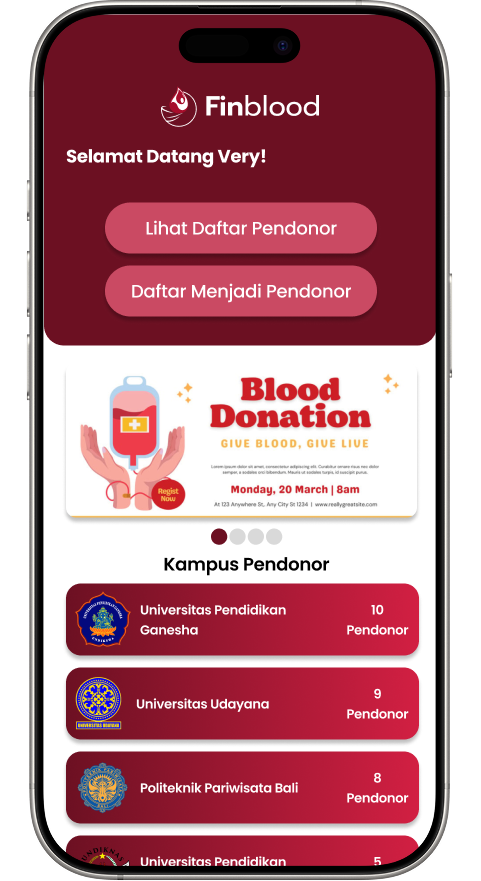
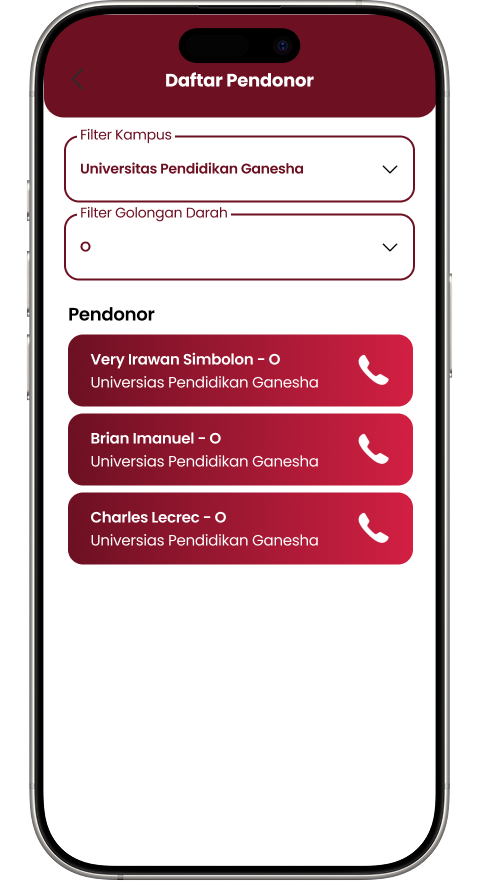

# Finblood

<p align="center">
  
</p>

**Project Pemrograman Mobile Kelompok Finblood**

- **Very Irawan Simbolon (2315091092)**
- **I Gede Surya Dharma Putra (2315091076)**
- **I Putu Tonyco Satria Pradipta (2315091058)**

Finblood adalah aplikasi mobile untuk memudahkan pencarian dan pendaftaran pendonor darah. Aplikasi ini membantu menghubungkan orang yang membutuhkan darah dengan sukarelawan pendonor darah dari berbagai kampus.

## Fitur Utama

- **Autentikasi Pengguna**: Pendaftaran, login, verifikasi email, dan reset kata sandi
- **Daftar Pendonor**: Lihat daftar pendonor darah berdasarkan kampus dan golongan darah
- **Daftar Menjadi Pendonor**: Tambahkan diri Anda ke database pendonor darah
- **Peringkat Kampus**: Lihat statistik jumlah pendonor dari setiap kampus
- **Kontak Langsung**: Hubungi pendonor langsung melalui nomor telepon

## Screenshot

<p align="center">
  
  &nbsp;&nbsp;&nbsp;
  
  &nbsp;&nbsp;&nbsp;
  
  &nbsp;&nbsp;&nbsp;
  
</p>

## Teknologi

- **Frontend**: Flutter
- **Backend**: Firebase (Authentication, Firestore, Cloud Functions)
- **Penyimpanan Data**: Cloud Firestore
- **Autentikasi**: Firebase Authentication
- **Pengelolaan Status**: Shared Preferences

## Prasyarat

- Flutter SDK (versi terbaru)
- Dart (versi terbaru)
- Firebase Project
- Android Studio / VS Code

## Instalasi

1. Clone repositori ini
   ```bash
   git clone https://github.com/verisimb/finblood.git
   cd finblood
   ```

2. Install dependencies
   ```bash
   flutter pub get
   ```

3. Jalankan aplikasi
   ```bash
   flutter run
   ```

## Struktur Database

### Collection: users
- **uid**: String (Primary Key)
- **nama**: String
- **email**: String
- **emailVerified**: Boolean
- **createdAt**: Timestamp
- **updatedAt**: Timestamp
- **displayName**: String

### Collection: pendonor
- **nama**: String
- **nomor_hp**: String
- **kampus**: String
- **golongan_darah**: String (A, B, AB, O)
- **timestamp**: Timestamp

## Cloud Functions

Aplikasi ini menggunakan Cloud Functions untuk:
- Verifikasi email pengguna
- Menghapus akun pengguna saat terjadi kegagalan pendaftaran

## Pengembangan Lebih Lanjut

- Integrasi dengan rumah sakit dan PMI
- Interaktif Carousel Slide (e.g., setiap slide dapat diklik untuk membuka artikel, halaman detail, atau tautan informasi kampanye).
